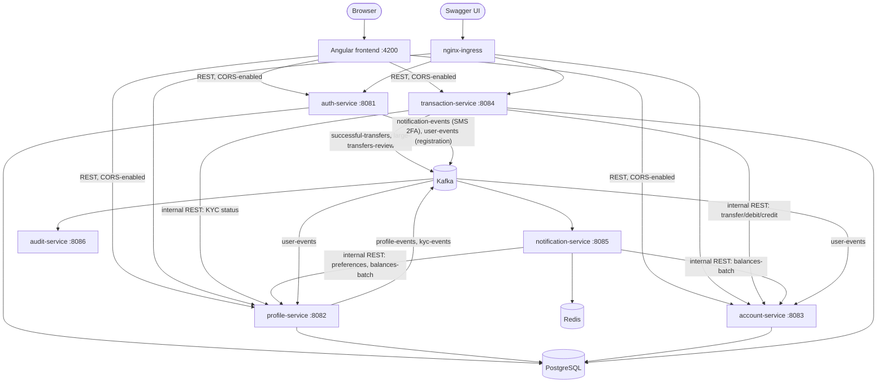

# Banking App — Microservices Platform

A Spring Boot microservices banking backend covering identity & 2FA, KYC, account management, internal/external transfers with fraud review, and event-driven notifications — built end-to-end from a real functional-requirements spec (see [Built from a real spec](#built-from-a-real-spec) below), not a toy CRUD demo.

## Architecture



`account-service` is the sole owner of the `accounts`/`transactions` tables (the balance ledger and dashboard history) — every other service that needs to move money or read balances goes through its internal API (`/api/v1/internal/**`) rather than touching those tables directly. `transaction-service` now keeps its own `wire_transactions` table for tracking external wire transfer status and fraud-review state, so the two services no longer share a table between them — `transaction-service` just calls `account-service`'s internal API to actually debit/credit an account once a wire clears.

`notification-service`'s internal Feign clients default to `localhost` (`:8083` for account-service, `:8082` for profile-service) so the whole stack works out of the box locally; the k8s `prod` profile overrides these via `PROFILE_SERVICE_URL`/`ACCOUNT_SERVICE_URL` env vars to reach the in-cluster service names instead.

## Tech stack

**Backend**
- **Java 17 / Spring Boot 3.3** — Spring Web, Spring Security (OAuth2 Resource Server), Spring Data JPA, Spring AOP, Spring Kafka, Spring Cache (Redis), OpenFeign
- **PostgreSQL 15** (Flyway migrations), **Apache Kafka** (KRaft mode, no ZooKeeper), **Redis 7**
- **JWT** (HS256, shared HMAC secret) — short-lived Full-Auth tokens, scoped Pre-Auth tokens for in-progress 2FA
- **JUnit 5 / Mockito / MockMvc / AssertJ** — every service has a full acceptance-test suite
- **Terraform** (AWS VPC/RDS/EKS) + **Helm** (Kafka/Redis/ingress-nginx) + **Kubernetes manifests** + **Docker** + **GitHub Actions** CI/CD

**Frontend** (`frontend/`)
- **Angular 22** (standalone components, signal-based state), **TypeScript**, plain CSS
- **Karma / Jasmine** for unit tests, **Cypress** for end-to-end tests
- JWT bearer auth with an HTTP interceptor (silent refresh-and-retry on 401), route guards on every authenticated page

## Built from a real spec

This system was implemented against 10 functional-requirement documents (FR1–FR10, covering 2FA, session management, KYC, profile updates, account overview, transaction history, internal/external transfers, and notifications) — not built ad hoc. Nearly every controller and service method carries a `FR#.# AC#` comment tracing it back to the specific user story and acceptance criterion it satisfies, so the spec-to-code mapping is auditable directly in the source.

## Services

| Service | Port | Responsibility |
|---|---|---|
| `01-auth-service` | 8081 | Login, registration, device fingerprinting, TOTP/SMS 2FA, refresh/logout, JWT issuance |
| `02-profile-service` | 8082 | KYC status/webhook/admin override, contact info, alert & daily-summary preferences; provisions a profile on registration |
| `03-account-service` | 8083 | Account dashboard, paginated transaction history — sole owner of the accounts ledger; provisions a starter account on registration |
| `03-transaction-service` | 8084 | Internal transfers, external wires, fraud-threshold review |
| `04-notification-service` | 8085 | Kafka-driven real-time alerts + scheduled daily balance summary (no REST API) |
| `05-audit-service` | 8086 | Immutable, insert-only audit log of profile/KYC changes (no REST API) |
| `frontend` | 4200 | Angular web client — login/2FA, dashboard, transactions, transfers, profile, alert preferences |

## Frontend

`frontend/` is an Angular 22 single-page app that talks to `auth-service`, `profile-service`, `account-service`, and `transaction-service` directly over REST (`notification-service` and `audit-service` have no REST API, so the frontend never calls them). Each of those four services has a `CorsConfigurationSource` bean scoped to `http://localhost:4200` with credentials enabled, since the frontend and backend run on different ports locally.

**Pages:** `/signup` (self-service registration) → `/login` (credentials + SMS 2FA) → `/dashboard` (account list) → `/accounts/:id/transactions` (paginated history) → `/transfer` (internal + external wire, KYC-gated) → `/profile` (contact info + KYC status) → `/profile/alerts` (threshold + daily summary).

**Registration provisioning:** `POST /api/v1/auth/register` (or the `/signup` page) creates the auth-service credentials, then publishes a `user-events` Kafka event that `profile-service` and `account-service` each consume independently to provision their own initial row — a `PENDING_VERIFICATION` profile and a `$0` `CHECKING` account — so a freshly-registered user has a usable (if empty) dashboard and KYC status immediately, no manual seeding required. See [Running this project](#running-this-project) below if you want to seed additional accounts or approve KYC for testing transfers.

## Running this project

**Prerequisites:** Docker Desktop running, Java 17 (JDK), and ports `5432`, `9092`, `6379`, and `8081`-`8086` free. No `.env` file or secrets setup needed — each service's `application.yml` already has dev-profile defaults that match `docker-compose.yml`, so this runs with zero configuration.

**1. Clone and start the infra stack** (Postgres, Kafka in KRaft mode, Redis) from the repo root:

```bash
git clone <this-repo-url>
cd my-banking-project
docker-compose up -d
```

**2. Start each service**, one per terminal, from that service's own directory (Windows: use `mvnw.cmd spring-boot:run` instead of `./mvnw spring-boot:run`):

| # | Directory | Command | Port |
|---|---|---|---|
| 1 | `01-auth-service` | `./mvnw spring-boot:run` | 8081 |
| 2 | `02-profile-service` | `./mvnw spring-boot:run` | 8082 |
| 3 | `03-account-service` | `./mvnw spring-boot:run` | 8083 |
| 4 | `03-transaction-service` | `./mvnw spring-boot:run` | 8084 |
| 5 | `04-notification-service` | `./mvnw spring-boot:run` | 8085 |
| 6 | `05-audit-service` | `./mvnw spring-boot:run` | 8086 |

`transaction-service` and `notification-service` call `account-service`/`profile-service` internally, so it's cleanest to start those two first — but since those are just REST calls, starting all six in any order works too as long as they're all up before you exercise the API.

**3. Verify it's working** — open any of the Swagger UIs below and try an endpoint (e.g. `POST /api/v1/auth/login` on the auth-service docs).

**4. Run the backend tests** for any service:

```bash
./mvnw test                    # run from inside any one service's directory
```

**5. Create a test user** — register via `POST /api/v1/auth/register` (or the frontend's `/signup` page) with `{"username", "password", "phoneNumber"}`. This is the preferred path: it also publishes the `user-events` Kafka event that provisions a `PENDING_VERIFICATION` profile and a `$0` checking account automatically (see [Frontend](#frontend) above) — `auth-service`, `profile-service`, and `account-service` all need to be running for that to happen.

If you'd rather skip the API and insert a user directly into Postgres (bcrypt hash below is for password `Password123!`), note that this bypasses the `user-events` publish entirely — you'll need to seed `user_profiles`/`accounts` rows yourself too:

```bash
docker exec banking-postgres-local psql -U dbadmin -d banking -c "
INSERT INTO users (username, password, phone_number, totp_enabled)
VALUES ('e2etest', '\$2b\$10\$FQ/4MWYZrC9XB.zJl1TFuemdJY2lMP7hFzpdHAkweAHHhZP2UBKme', '+15551234567', false);
"
```

Either way, if you want to test transfers, KYC starts out `PENDING_VERIFICATION` (they're KYC-gated) — update it to `APPROVED` directly in `user_profiles`. First login from a new browser is a 2FA challenge — the SMS code is only published to Kafka (`notification-service` just logs it, since email/SMS providers are placeholders) — so for local testing without running `notification-service`, insert a `recognized_devices` row for that user (`device_hash` = base64(SHA-256(raw-device-id))) and send that raw value as a `Device-ID` cookie on login to skip 2FA entirely.

**6. Start the frontend** from `frontend/`:

```bash
npm install
npm run start                  # ng serve, http://localhost:4200
```

Run its tests with `npm test` (Karma/Jasmine) or `npx cypress run` (Cypress E2E — needs the full backend + `ng serve` already running, plus the seeded user above).

**7. Shut down** the infra stack when you're done:

```bash
docker-compose down
```

### API docs

`auth-service`, `profile-service`, `account-service`, and `transaction-service` each expose interactive Swagger UI once running locally:

- http://localhost:8081/swagger-ui.html
- http://localhost:8082/swagger-ui.html
- http://localhost:8083/swagger-ui.html
- http://localhost:8084/swagger-ui.html

## Infrastructure

Terraform (`terraform/`) defines the target AWS footprint (VPC, RDS Postgres, EKS with a managed node group); Helm values (`helm/`) configure Kafka/Redis/ingress-nginx on the cluster; `k8s/` holds the namespace, config/secrets, and per-service Deployment/Service manifests. `.github/workflows/build-and-test.yml` runs every service's test suite on every push/PR to `main`. `.github/workflows/deploy-to-eks.yml` (GHCR image build/push + `kubectl apply` to EKS) exists but is entirely commented out until the four AWS secrets it needs are actually configured — see the comment at the top of that file to re-enable it.

**This has been validated (`terraform validate` → `Success!`) but deliberately not applied** — standing up a real EKS/RDS environment costs real money on an ongoing basis, which isn't worthwhile for a portfolio project. Everything below the ingress has been exercised locally via `docker-compose` instead.

## Known limitations

Being upfront about what's intentionally not production-complete:

- **Email/SMS providers are placeholders.** `LoggingEmailProviderClient` logs instead of calling a real vendor (SendGrid/Twilio slots exist and are documented in the FR docs, just not wired to real accounts).
- **No role-based authorization system yet.** Profile-service's admin KYC-override endpoint requires `ADMIN`/`COMPLIANCE_OFFICER` roles, but nothing in the system currently grants roles to a user — that endpoint is reachable in code but not yet in a real deployment.
- **Kafka-provisioned profiles/accounts are minimal.** The `user-events` consumer in `profile-service`/`account-service` (see [Frontend](#frontend) above) only sets the bare minimum — a `PENDING_VERIFICATION` profile with no address, and a single `$0` checking account. If Kafka is down when a user registers, they end up with credentials but no profile/account until manually backfilled (no dead-letter/retry queue yet, just a logged error).
- **`/api/v1/profile/alerts/**` isn't in the k8s ingress routes** (`k8s/08-ingress-routes.yaml` only routes `/api/v1/profiles`, plural) — the Alert Preferences page works fine against `docker-compose`/local ports, but would 404 if deployed behind the ingress unchanged.
- **IaC is validated, not deployed** (see [Infrastructure](#infrastructure) above).

## License

MIT — see [LICENSE](LICENSE).
