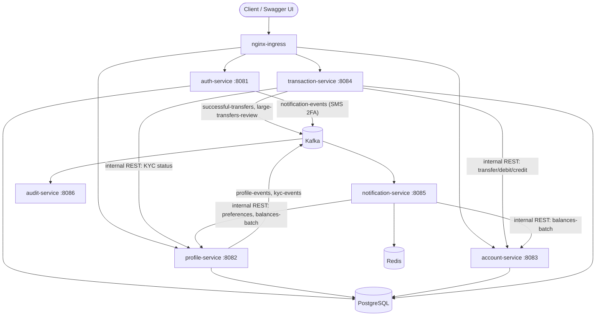

# Banking App — Microservices Platform

A Spring Boot microservices banking backend covering identity & 2FA, KYC, account management, internal/external transfers with fraud review, and event-driven notifications — built end-to-end from a real functional-requirements spec (see [Built from a real spec](#built-from-a-real-spec) below), not a toy CRUD demo.

## Architecture



`account-service` is the sole owner of the `accounts`/`transactions` tables — every other service that needs to move money or read balances goes through its internal API (`/api/v1/internal/**`) rather than touching Postgres directly, keeping each service's data ownership boundary clean.

`notification-service`'s internal Feign clients default to `localhost` (`:8083` for account-service, `:8082` for profile-service) so the whole stack works out of the box locally; the k8s `prod` profile overrides these via `PROFILE_SERVICE_URL`/`ACCOUNT_SERVICE_URL` env vars to reach the in-cluster service names instead.

## Tech stack

- **Java 17 / Spring Boot 3.3** — Spring Web, Spring Security (OAuth2 Resource Server), Spring Data JPA, Spring AOP, Spring Kafka, Spring Cache (Redis), OpenFeign
- **PostgreSQL 15** (Flyway migrations), **Apache Kafka** (KRaft mode, no ZooKeeper), **Redis 7**
- **JWT** (HS256, shared HMAC secret) — short-lived Full-Auth tokens, scoped Pre-Auth tokens for in-progress 2FA
- **JUnit 5 / Mockito / MockMvc / AssertJ** — every service has a full acceptance-test suite
- **Terraform** (AWS VPC/RDS/EKS) + **Helm** (Kafka/Redis/ingress-nginx) + **Kubernetes manifests** + **Docker** + **GitHub Actions** CI/CD

## Built from a real spec

This system was implemented against 10 functional-requirement documents (FR1–FR10, covering 2FA, session management, KYC, profile updates, account overview, transaction history, internal/external transfers, and notifications) — not built ad hoc. Nearly every controller and service method carries a `FR#.# AC#` comment tracing it back to the specific user story and acceptance criterion it satisfies, so the spec-to-code mapping is auditable directly in the source.

## Services

| Service | Port | Responsibility |
|---|---|---|
| `01-auth-service` | 8081 | Login, device fingerprinting, TOTP/SMS 2FA, refresh/logout, JWT issuance |
| `02-profile-service` | 8082 | KYC status/webhook/admin override, contact info, alert & daily-summary preferences |
| `03-account-service` | 8083 | Account dashboard, paginated transaction history — sole owner of the accounts ledger |
| `03-transaction-service` | 8084 | Internal transfers, external wires, fraud-threshold review |
| `04-notification-service` | 8085 | Kafka-driven real-time alerts + scheduled daily balance summary (no REST API) |
| `05-audit-service` | 8086 | Immutable, insert-only audit log of profile/KYC changes (no REST API) |

## Running this project

**Prerequisites:** Docker Desktop running, Java 17 (JDK), and ports `5432`, `9092`, `6379`, and `8081`-`8086` free. No `.env` file or secrets setup needed — each service's `application.yml` already has dev-profile defaults that match `docker-compose.yml`, so this runs with zero configuration.

**1. Clone and start the infra stack** (Postgres, Kafka in KRaft mode, Redis) from the repo root:

```bash
git clone <this-repo-url>
cd my-banking-project
docker-compose up -d
```

**2. Start each service**, one per terminal, from that service's own directory (Windows: use `mvnw.cmd spring-boot:run` instead of `./mvnw spring-boot:run`):

| # | Directory | Command | Port |
|---|---|---|---|
| 1 | `01-auth-service` | `./mvnw spring-boot:run` | 8081 |
| 2 | `02-profile-service` | `./mvnw spring-boot:run` | 8082 |
| 3 | `03-account-service` | `./mvnw spring-boot:run` | 8083 |
| 4 | `03-transaction-service` | `./mvnw spring-boot:run` | 8084 |
| 5 | `04-notification-service` | `./mvnw spring-boot:run` | 8085 |
| 6 | `05-audit-service` | `./mvnw spring-boot:run` | 8086 |

`transaction-service` and `notification-service` call `account-service`/`profile-service` internally, so it's cleanest to start those two first — but since those are just REST calls, starting all six in any order works too as long as they're all up before you exercise the API.

**3. Verify it's working** — open any of the Swagger UIs below and try an endpoint (e.g. `POST /api/v1/auth/register` on the auth-service docs).

**4. Run the tests** for any service:

```bash
./mvnw test                    # run from inside any one service's directory
```

**5. Shut down** the infra stack when you're done:

```bash
docker-compose down
```

### API docs

`auth-service`, `profile-service`, `account-service`, and `transaction-service` each expose interactive Swagger UI once running locally:

- http://localhost:8081/swagger-ui.html
- http://localhost:8082/swagger-ui.html
- http://localhost:8083/swagger-ui.html
- http://localhost:8084/swagger-ui.html

## Infrastructure

Terraform (`terraform/`) defines the target AWS footprint (VPC, RDS Postgres, EKS with a managed node group); Helm values (`helm/`) configure Kafka/Redis/ingress-nginx on the cluster; `k8s/` holds the namespace, config/secrets, and per-service Deployment/Service manifests; GitHub Actions (`.github/workflows/`) builds/tests every push and pushes images to GHCR.

**This has been validated (`terraform validate` → `Success!`) but deliberately not applied** — standing up a real EKS/RDS environment costs real money on an ongoing basis, which isn't worthwhile for a portfolio project. Everything below the ingress has been exercised locally via `docker-compose` instead.

## Known limitations

Being upfront about what's intentionally not production-complete:

- **Email/SMS providers are placeholders.** `LoggingEmailProviderClient` logs instead of calling a real vendor (SendGrid/Twilio slots exist and are documented in the FR docs, just not wired to real accounts).
- **No role-based authorization system yet.** Profile-service's admin KYC-override endpoint requires `ADMIN`/`COMPLIANCE_OFFICER` roles, but nothing in the system currently grants roles to a user — that endpoint is reachable in code but not yet in a real deployment.
- **No frontend.** This is a backend-only system; there's no web client, by design, for this stage of the project.
- **IaC is validated, not deployed** (see [Infrastructure](#infrastructure) above).

## License

MIT — see [LICENSE](LICENSE).
